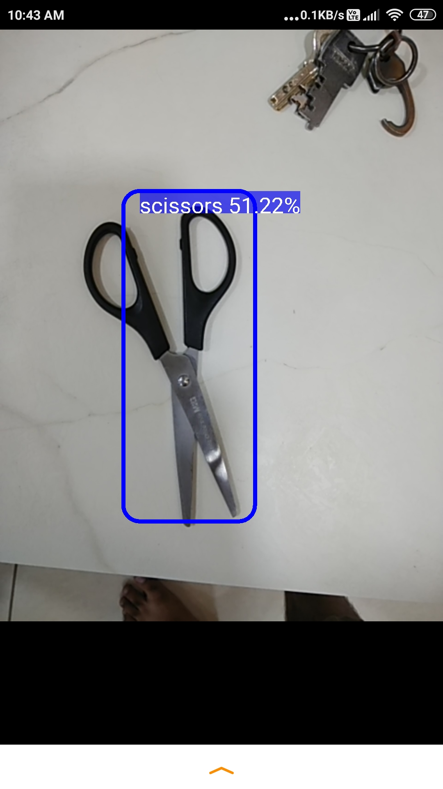
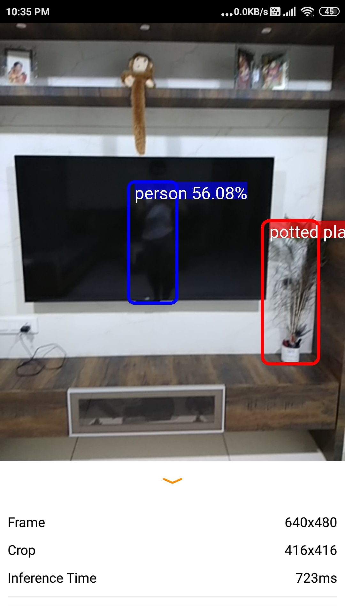

## object_detection_with_voice_alert

## Android app for detecting object and gives voice alert  

## Accuracy
Model was trained on 10K+ images and achieved an accuracy of 87% (best was 92%) on live camera.

## Usage
blind person assistant system, self driving car, robotics, drone system, e-commerce management system in which the machine has to detect the object and act accordingly like, if in robotics system stairs are detected then climb it and apple is detected then take it.

